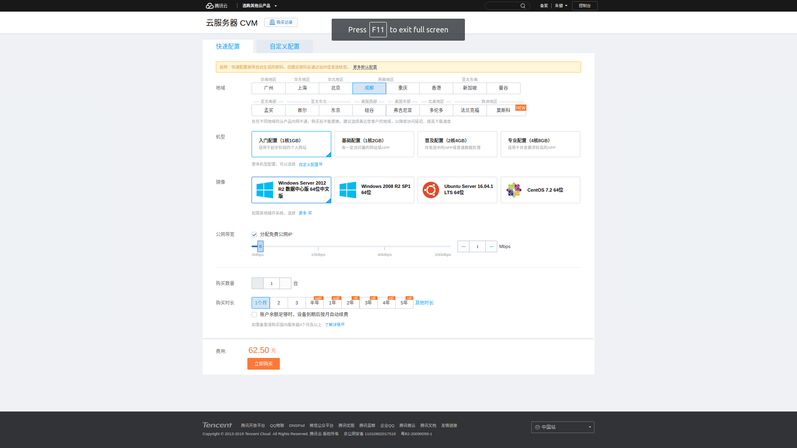

# 腾讯云服务器

身边只有笔记本，所以在线购买云服务器进行开发。当前主流云有阿里云、亚马逊云和腾讯云，之间的价格、配置啥的都差不多

几个云都看了一下，各种新的名词术语，觉得[腾讯云服务器](https://cloud.tencent.com/product/cvm)比较简单，所以选择腾讯云进行开发

*首次开发会有免费试用，不过需要特定时间抢购*

我选择了一个最简单的默认配置

    地域 : 成都

    可用区 : 成都二区

    机型 : 系列2、标准型1核CPU、1G内存

    镜像 : Ubuntu Server 16.04.1 LTS 64位

    存储 : 系统盘（50G高效云硬盘）

    网络 : vpc-0z0cd0ky|subnet-03abhtcz

    带宽 : 按带宽计费（带宽1Mbps）

    名称 : ubuntu-1GB-cd-8916

