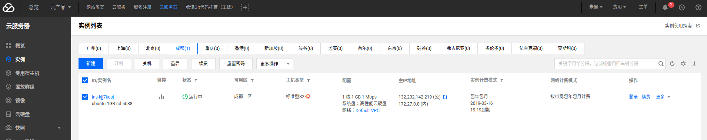
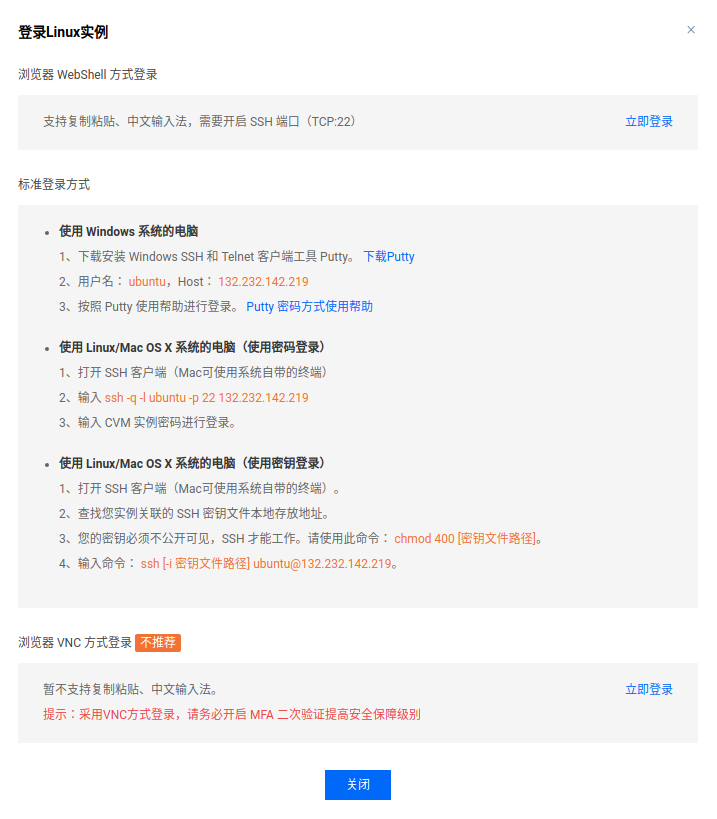

# [Ubuntu 16.04]云服务器登录

购买完成后即跳往[实例列表](https://console.cloud.tencent.com/cvm/index)，显示了实例名、状态、主`IP`地址等信息

## 密码设置

登录需要密码，可以点击**重置密码**选项或者点击**列表选项更多->密码/密钥->重置密码**进行密码设置

## 登录

点击**列表选项登录**，会提示有多种登录方式

常用的有**使用密码登录**

* 打开`SSH`客户端
* 输入`ssh -q -l ubuntu -p 22 132.232.142.219`
* 输入`CVM`密码

或者是**密钥登录**

* 打开`SSH`客户端
* 查找您实例关联的 `SSH` 密钥文件本地存放地址。
* 您的密钥必须不公开可见，`SSH` 才能工作。请使用此命令： `chmod 400 [密钥文件路径]`。
* 输入命令： `ssh [-i 密钥文件路径] ubuntu@132.232.142.219`。

密钥登录还需要上传公钥到云服务器，点击**更多->密码/密钥->加载密钥->点击新建->创建密钥->使用已有公钥**，输入本地生成的公钥即可