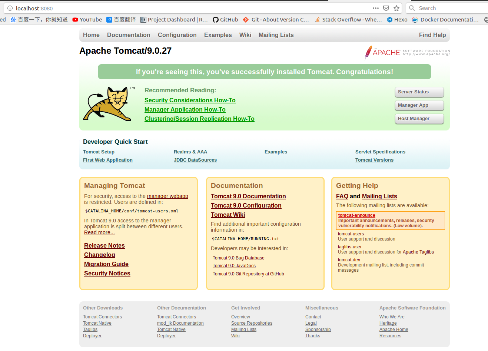

# [Ubuntu 16.02]Tomcat9安装

参考：

[Ubuntu16.04安装Tomcat](https://blog.csdn.net/ItJavawfc/article/details/87370956)

[Ubuntu16.04服务器安装tomcat](https://blog.csdn.net/Shezzer/article/details/84074133)

## 下载

当前最新版本：`Tomcat 9.0.27`。下载地址：[Tomcat 9 Software Downloads](https://tomcat.apache.org/download-90.cgi)

## 配置

解压到`/opt`目录下，修改文件`/bin/setclasspath.sh`，在结尾添加`JDK`环境变量

```
export JAVA_HOME=/home/zj/software/java/jdk1.8.0_201
export JRE_HOME=$JAVA_HOME/jre
```

## 启动

执行文件`/bin/startup.sh`，即可启动`Tomcat`

```
# ./startup.sh 
Using CATALINA_BASE:   /opt/apache-tomcat-9.0.27
Using CATALINA_HOME:   /opt/apache-tomcat-9.0.27
Using CATALINA_TMPDIR: /opt/apache-tomcat-9.0.27/temp
Using JRE_HOME:        /home/zj/software/java/jdk1.8.0_201/jre
Using CLASSPATH:       /opt/apache-tomcat-9.0.27/bin/bootstrap.jar:/opt/apache-tomcat-9.0.27/bin/tomcat-juli.jar
Tomcat started.
```

查询`localhost:8080`是否已被监听

```
# curl localhost:8080
<!DOCTYPE html>
<html lang="en">
    <head>
        <meta charset="UTF-8" />
        <title>Apache Tomcat/9.0.27</title>
...
...
```



## 停止

调用脚本`/bin/shutdown.sh`

## 开机自启动

修改文件`/etc/rc.local`

```
#!/bin/sh -e
#
# rc.local
#
# This script is executed at the end of each multiuser runlevel.
# Make sure that the script will "exit 0" on success or any other
# value on error.
#
# In order to enable or disable this script just change the execution
# bits.
#
# By default this script does nothing.

/opt/apache-tomcat-9.0.27/bin/startup.sh

exit 0
```

## 非root用户运行

设置`tomcat`以普通用户运行，网上找了很多资料

[用非root用户启动tomcat进程](https://rorschachchan.github.io/2018/04/18/%E4%BD%BF%E7%94%A8%E6%99%AE%E9%80%9A%E7%94%A8%E6%88%B7%E5%90%AF%E5%8A%A8tomcat/)

[How To Install Apache Tomcat 8 on Ubuntu 16.04](https://www.digitalocean.com/community/tutorials/how-to-install-apache-tomcat-8-on-ubuntu-16-04)

[Tomcat用普通用户身份运行](http://www.zhengdazhi.com/archives/1382)

最实在的是[ubuntu非root用户启动tomcat权限问题](https://blog.csdn.net/qq_26012495/article/details/86220563)，直接将`tomcat`文件夹设置为当前用户，然后启动`tomcat`即可