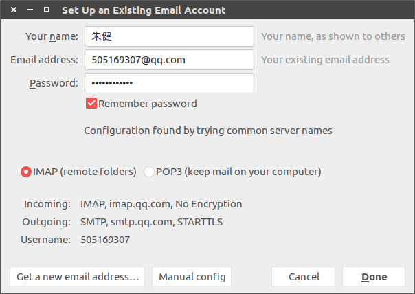
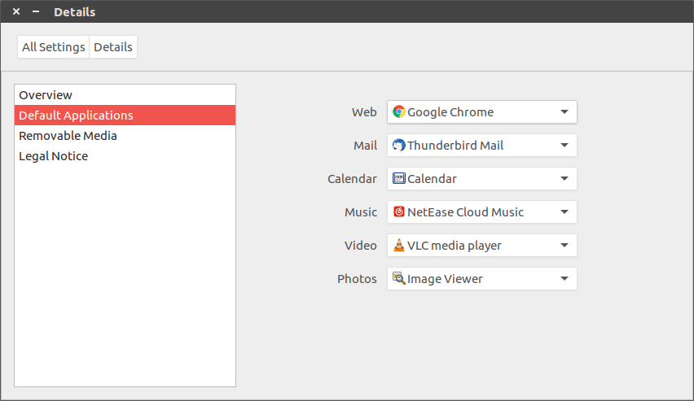

# [Ubuntu 16.04]Thunderbird邮箱使用

参考：[使用技巧](https://support.mozilla.org/zh-CN/products/thunderbird/tips-and-tricks)

`Thunderbird`是`Ubuntu 16.04`默认使用的邮箱客户端，记录一下如何进行`163`邮箱的程序设置

## `IMAP vs POP3`

参考：

[POP3](https://baike.baidu.com/item/POP3/175122?fr=aladdin)

[imap](https://baike.baidu.com/item/imap/350154?fr=aladdin)

[IMAP 同步](https://support.mozilla.org/zh-CN/kb/imap)

[IMAP和POP3有什么区别?](http://help.163.com/10/0203/13/5UJONJ4I00753VB8.html)

`POP3(Post Office Protocol - Version 3)`，指`邮局协议版本3`，使用端口号为`110`

`IMAP(Internet Mail Access Protocol)`，指`因特网邮件访问协议`（或称为`交互邮件访问协议`），使用端口号为`143`

`IMAP`和`POP3`都属于`TCP/IP`协议族，用于邮件客户端对服务器邮件的获取。`IMAP`相对于`POP3`的优点在于`IMAP`允许客户端和服务器保持双向通信，而`POP3`仅允许客户端对服务器的单向通信

    POP3协议允许电子邮件客户端下载服务器上的邮件，但是在客户端的操作（如移动邮件、标记已读等），不会反馈到服务器上，比如通过客户端收取了邮箱中的3封邮件并移动到其他文件夹，邮箱服务器上的这些邮件是没有同时被移动的 。
    而IMAP提供webmail 与电子邮件客户端之间的双向通信，客户端的操作都会反馈到服务器上，对邮件进行的操作，服务器上的邮件也会做相应的动作。

### 启用`IMAP`

参考：[使用 IMAP 在其他电子邮件客户端上查看 Gmail](https://support.google.com/mail/answer/7126229?visit_id=636863274743440829-2233231335&rd=1)

对于`163`邮箱，需要在`设置->POP3/SMTP/IMAP`中启用`IMAP/SMTP`服务

对于`gmail`邮箱，需要在`设置->转发和POP/IMAP`中启用`IMAP`服务

## 163邮箱设置

点击菜单项`File->New->Existing Email Account`，跳出登录框

输入姓名、`Email`地址和密码，点击`Continue`

选择`IMAP(remote folders)`模式，点击`Done`即完成设置

### `163`

参考：[网易163邮箱无法使用第三方客户端登录问题解决](https://blog.csdn.net/u013401853/article/details/69366360)

输入的密码是`客户端授权密码`，需要登录163邮箱，在菜单项`设置`中编辑`客户端授权密码`

## 系统默认邮箱设置

参考：[使 Thunderbird 成为默认邮件客户端](https://support.mozilla.org/zh-CN/kb/%E4%BD%BFThunderbird%E6%88%90%E4%B8%BA%E9%BB%98%E8%AE%A4%E9%82%AE%E4%BB%B6%E5%AE%A2%E6%88%B7%E7%AB%AF)

进入系统设置页面，选择`Details->Default Applications->Mail`，选择`Thunderbird`邮箱即可

