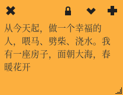

# [Indicator Stickynotes]桌面便签

偶然的机会在其他人电脑上看到桌面便签，非常实用，参考[4个最佳的Linux便签应用程序:Stickynotes,Xpad,KNotes,Pin ‘Em Up](https://ywnz.com/linuxrj/5783.html)安装`Indicator Stickynotes`

## 安装

```
sudo add-apt-repository ppa:umang/indicator-stickynotes

sudo apt update

sudo apt install indicator-stickynotes -y
```

## 使用

进入菜单栏，选择`Indicator Stickynotes`图标即可打开。可以配置背景颜色、字体颜色和字体格式

