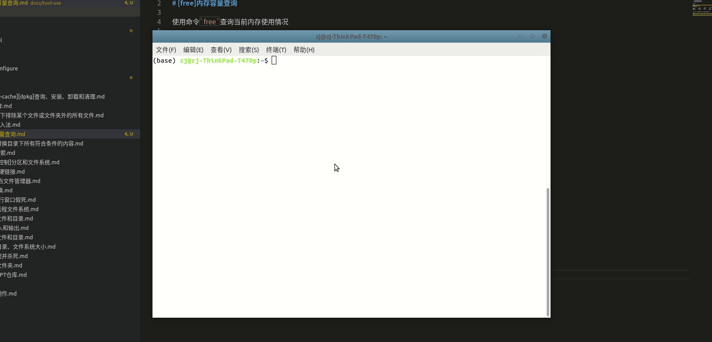

# [free]内存容量查询

使用命令`free`查询当前内存使用情况

## 定义

```
free [选项]
```

常用选项有：

1. -b：以字节显示输出
2. -m：以M字节显示输出
3. -g：以G字节显示输出

## 示例

```
# 以M字节显示输出
$ free -m
              总计         已用        空闲      共享    缓冲/缓存    可用
内存：       15782       12023         812         391        2945        3154
交换：        2047          21        2026
```

配合`watch`命令，每隔`1s`查询一次并显示

```
$ watch -n 1 free -m
```

